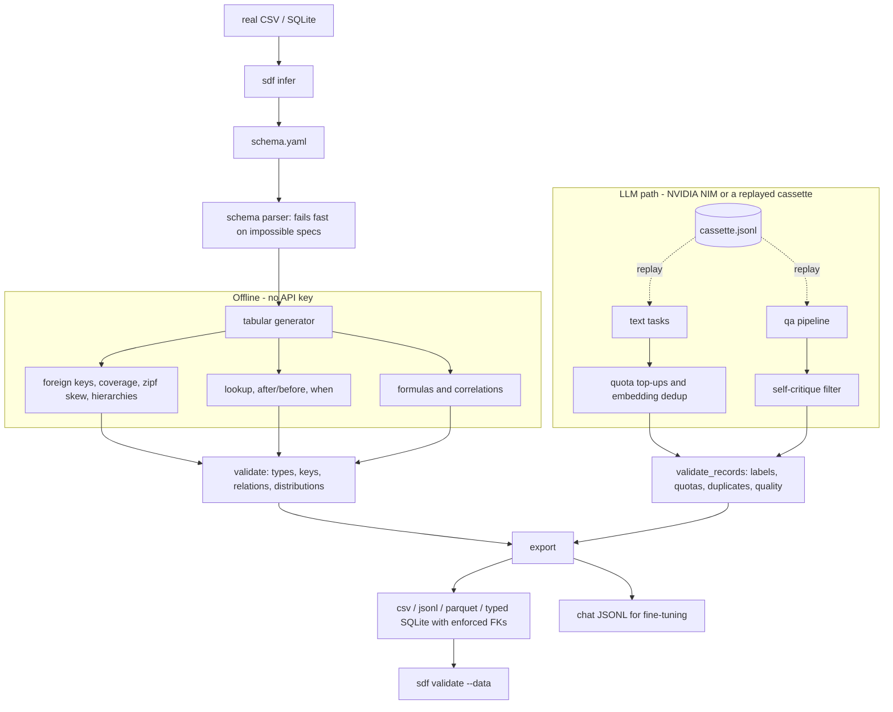

# synthetic-data-factory

**Generate realistic synthetic datasets from a schema.** You get related tables that stay consistent with each other (zero API, fully offline), a schema inferred from your real data in one command, and LLM-generated text, reviews and Q&A pairs on free NVIDIA NIM that you can record once and replay with no key. Every output is validated and can be exported for fine-tuning.


Say you need 5,000 order lines where every order belongs to a real customer, no order predates the customer's signup, the unit price is the product's catalog price, and `line_total` equals `quantity * unit_price`. Or you want a copy of your production database with the same shape and no real values in it. Or you need a class-balanced text-classification set that you can rebuild in CI without an API key. This tool does all three from a small YAML file.

---

## Why

Most "fake data" tools produce disconnected rows. You get a `customer_id` in `orders` that points at no customer, a free-plan account paying $11,000 a month, categoricals that ignore the weights you asked for, and nothing that proves the output matches the spec. Most *LLM* data generators skip the boring parts that matter: deduplication, class balance that actually holds, a quality filter, and a way to reproduce the run.

This tool treats the two problems separately, because they are different problems:

- **Structured data is solvable in code.** Names, emails, dates, foreign keys, lookups, temporal order, per-category rules, formulas and correlations are generated deterministically with no LLM. Generation is instant, free, reproducible from a seed, and validated against the schema that produced it.
- **Unstructured data needs a model, and a careful pipeline around it.** Text, reviews and Q&A pairs go through diversity-seeded prompts, embedding-based dedup, enforced per-class quotas with top-up rounds, a self-critique filter for Q&A, and record/replay cassettes that make runs reproducible.

Everything is synthetic by construction and labelled as synthetic. Nothing is scraped, and nothing describes a real person.

---

## Architecture



The tabular path (left) is pure Python. The text and Q&A paths call NIM, or replay a recorded cassette with no key and no network. Both paths end in a validation step. The tabular data and the text records each have their own checks, and both write through the same export module.

---

## Use cases

| Use case | What you do | Path |
| --- | --- | --- |
| **Test and demo databases** | Generate related tables with valid, *enforced* foreign keys to seed a dev DB | `generate tabular` |
| **Load testing** | Generate millions of deterministic rows, identical on every run | `generate tabular` |
| **Privacy-safe sharing** | Infer a schema from production, then generate a stand-in with the same shape and no real values | `infer` then `generate` |
| **Checking an export** | Check CSVs or a SQLite file on disk against a schema (types, keys, relations) | `validate --data` |
| **Fine-tuning corpora** | Build class-balanced classification data or instruction pairs as chat JSONL | `generate text` / `generate qa` |
| **RAG evaluation sets** | Build Q&A pairs from your own docs, with hard negatives and a quality filter | `generate qa` |
| **Reproducible LLM datasets** | Record once against NIM, replay anywhere (in CI, offline) with byte-identical output | `--record` / `--replay` |

---

## Quickstart

```bash
git clone https://github.com/AleBrito124356/synthetic-data-factory.git
cd synthetic-data-factory
pip install -e ".[dev]"          # installs the `sdf` command (python -m factory also works)

# Tabular needs nothing else, so you can generate right now:
sdf generate tabular --schema schemas/ecommerce.yaml --out results/ --format csv,sqlite --validate
```

From a checkout without installing, `python cli.py ...` runs the same command line.

For live text/qa generation, get a **free** NVIDIA NIM key. It takes about two minutes at
[build.nvidia.com](https://build.nvidia.com): open any model, click *Get API Key*, and copy the `nvapi-...` value.

```bash
cp .env.example .env   # then paste the key: NVIDIA_API_KEY=nvapi-your-real-key
```

The `.env` file is read from the current directory only. You don't need a key to see what a text task will send (`--dry-run`) or to rebuild a dataset from a recorded cassette (`--replay`).

---

## Usage

### 1. Tabular data (offline)

```bash
sdf generate tabular --schema schemas/ecommerce.yaml --out results/ \
    --format csv,jsonl,sqlite --validate
```

```
Generated tables:
  customers: 500 rows
  products: 80 rows
  orders: 2000 rows
  order_items: 5000 rows

Wrote 9 file(s) to results/:
  ...
51/51 checks passed (OK).
...
[PASS] temporal_order :: orders.order_date
        after customer_id.signup_date: 2000 row(s) checked
[PASS] parent_coverage :: order_items.order_id
        every orders row has >= 1 order_items row(s)
[PASS] lookup_consistency :: order_items.unit_price
        unit_price == product_id -> price
```

`--validate` checks the output against the schema:

- **Types and ranges.** Numbers fall inside `[min, max]` and dates inside `[start, end]`. Emails must be valid addresses on reserved RFC 2606 domains. Phones must be in the fictional 555-01xx block. IPs must be in the RFC 5737 documentation ranges.
- **Keys.** Unique and id columns have no duplicates, ids and foreign keys are not null, and every foreign key resolves. Self-references must form an acyclic hierarchy.
- **Relations.** `temporal_order`, `lookup_consistency`, `when_bounds` and `parent_coverage` hold on every row.
- **Distributions.** Categorical proportions match the requested weights, per `when` case where one is set.

The SQLite file is a real relational database:

- Sequential ids are `INTEGER PRIMARY KEY`, and foreign keys inherit the parent column's type.
- Formula columns are typed from their values.
- Every referenced column is `UNIQUE`, and foreign-key columns are indexed.
- The export finishes with `PRAGMA foreign_keys=ON; PRAGMA foreign_key_check` and refuses to write an inconsistent file.

```python
>>> import sqlite3; c = sqlite3.connect("results/dataset.db")
>>> c.execute("SELECT count(*) FROM order_items WHERE line_total > 1000").fetchone()
(702,)
>>> c.execute("SELECT p.category, round(sum(i.line_total), 2) FROM order_items i "
...           "JOIN products p USING (product_id) GROUP BY 1 ORDER BY 2 DESC LIMIT 1").fetchone()
('electronics', 874128.28)
```

### 2. Distribution report

```bash
sdf report --schema schemas/saas-users.yaml
```

```
- plan [category] nulls=0
    observed/expected: free=0.55/0.55, pro=0.30/0.30, enterprise=0.15/0.15
- seats [int] nulls=0
    min=1 max=250 mean=21.8 std=44.1
    when plan=free:
      min=1 max=3 mean=2.01 std=0.718
    when plan=pro:
      min=3 max=50 mean=13 std=9.5
    when plan=enterprise:
      min=51 max=250 mean=112 std=55.6
- mrr [float] nulls=0
    min=0 max=1.15e+04 mean=1.47e+03 std=2.67e+03
    when plan=free:
      min=0 max=0 mean=0 std=0
    when plan=pro:
      min=187 max=2.34e+03 mean=1.27e+03 std=596
    when plan=enterprise:
      min=3.04e+03 max=1.15e+04 mean=7.23e+03 std=2.41e+03
```

### 3. Infer a schema from real data, then check files on disk

Point `sdf infer` at a folder of CSV/JSONL files or at a SQLite database:

```bash
sdf infer --data prod_export/ --out schemas/prod-like.yaml [--rows-scale 0.1] [--min-category-count 5]
sdf generate tabular --schema schemas/prod-like.yaml --out synthetic/ --format csv,sqlite --validate
```

Here is a captured run on the `results/` CSVs from step 1:

```
Inferred 4 table(s) from results/ (csv):
  customers: 500 -> 500 rows, 8 fields, key customer_id
  orders: 2000 -> 2000 rows, 5 fields, key order_id
  products: 80 -> 80 rows, 6 fields, key product_id
  order_items: 5000 -> 5000 rows, 6 fields, key item_id
Relations:
  foreign key: order_items.product_id -> products.product_id, min_per_parent 15, zipf s=0.8
  foreign key: order_items.order_id -> orders.order_id, min_per_parent 1
  foreign key: orders.customer_id -> customers.customer_id
  lookup: order_items.unit_price = products.price via product_id
  temporal: orders.order_date after customer_id.signup_date
  formula: order_items.line_total = round(quantity * unit_price, 2)
  formula: products.cost = round(price * 0.6, 2)
  correlation: customers.lifetime_value ~ loyalty_years (rank rho +0.93)

Wrote results/inferred.yaml

# Fidelity: real vs synthetic
## customers
  country                category  category TVD 0.000
  lifetime_value         float     mean 2516 vs 2406, std 1125 vs 1039, range [35.71, 4797] vs [210.3, 4782]
## order_items
  line_total             formula   mean 546.2 vs 555.1, std 395.4 vs 395.6, range [8.53, 1969] vs [11.97, 1939]
...
```

What it detects:

- **Keys and ids.** Sequential or prefixed ids, uuids, and emails, including emails derived from a name column.
- **Column types.** bool, int, float, date, datetime, and weighted categories. Names, phones, cities, companies and similar columns map to fictional value pools.
- **Statistics.** min/max, rounding, null rate, and a uniform, normal or exponential fit.
- **Foreign keys.** Found by value containment in a unique parent column, and confirmed by naming or by non-numeric key values. Each one carries `min_per_parent` and a fitted Zipf skew.
- **Other relations.** Lookups, exact formulas (`a*b`, `a+b`, `a-b`, `a*c`), `after`/`before` anchors, and rank correlations.

**Privacy.** The schema holds no real values except category labels. Any label seen fewer than `--min-category-count` times (default 5) is merged into `other`, so a rare value that could identify someone never reaches the schema. Names, emails, phones and free text are regenerated from fictional pools. This limits disclosure but is not a formal privacy guarantee, so review the YAML before you share data generated from it.

`sdf validate --data` checks files that already exist against a schema. It runs the same checks as `--validate`, plus a check that every table and column is present. It exits with 1 on any failure:

```
$ sdf validate --schema schemas/ecommerce.yaml --data broken_export/
54/55 checks passed (FAILURES PRESENT).
[FAIL] foreign_key :: order_items.order_id
        1 orphan value(s) not found in orders.order_id, e.g. 'ORD-999999'
```

### 4. Text datasets (NIM, or a replayed cassette)

```bash
# See the plan first - no key, nothing sent:
sdf generate text --task schemas/text-task.yaml --out results/reviews.jsonl --dry-run

# Generate live, record every request/response, and validate the records:
sdf generate text --task schemas/text-task.yaml --out results/reviews.jsonl \
    --chat results/reviews.chat.jsonl --record results/reviews.cassette.jsonl --validate

# Later, anywhere, with no key and no network: byte-identical output
sdf generate text --task schemas/text-task.yaml --out results/reviews.jsonl \
    --replay results/reviews.cassette.jsonl
```

The dry run prints this. It is real output and needs no key:

```
Dry run: task 'reviews' (no requests sent, no key needed)
  planned chat requests:      24
  planned embedding requests: 3
  quotas: positive=12, neutral=5, negative=7
  top-up: up to 4 more round(s) per group, only when dedup or short replies leave it under quota
```

A recorded run prints the following. This was captured against the local OpenAI-compatible server that the test suite uses; with NIM, the text differs but the counts are enforced the same way:

```
Wrote 24 text record(s) to results/reviews.jsonl
  sentiment distribution: negative=7, neutral=5, positive=12
  requests: 24 chat; dedup: embedding
Recorded 27 request(s) to cassette results/reviews.cassette.jsonl
...
[PASS] quota :: reviews.sentiment
        positive=12/12, neutral=5/5, negative=7/7
[PASS] duplicates :: reviews.text
        0 duplicate(s), rate 0.000 (max 0.000)
```

**Quotas are enforced, not hoped for.** Each group (label, sentiment, category, seed or context) has a target count. When dedup or a short model reply leaves a group under its target, a bounded top-up round asks for exactly the missing number and shows the model a few existing examples to avoid. If a group is still short after `max_rounds`, the run prints a `WARNING shortfall` line, and `--validate` fails the `quota` check.

Swap `task:` in the YAML to `classification`, `personas`, `tickets` or `paraphrase`. The optional keys are `max_rounds`, `dedup` (`embedding` | `lexical` | `none`), `dedup_threshold` and `max_duplicate_rate`.

### 5. Q&A / instruction pairs (NIM, or a replayed cassette)

```bash
sdf generate qa --task schemas/qa-example.yaml \
    --out results/qa.jsonl --chat results/qa.chat.jsonl --with-context --validate
```

Each pair carries `question`, `answer`, `context`, `source`, a `hard_negative` and per-axis `quality` scores. The run summary lists how many candidate questions were dropped as duplicates, as unanswerable (`NOT_IN_PASSAGE`), or for scoring below `min_quality`. `--validate` checks required fields, answerability, minimum quality, that each hard negative differs from its answer, and that no question repeats. The `--chat` file is ready for the trainers in **fine-tuning-playbook**. `--record`, `--replay` and `--dry-run` work here too.

### As a library

```python
from factory import generate, validate_dataset, export_dataset, infer_schema, load_raw, validate_data

dataset = generate("schemas/ecommerce.yaml", seed=42)
assert validate_dataset(dataset).ok
export_dataset(dataset, "results/", formats=["parquet", "sqlite"])
df = dataset.to_pandas()["orders"]                      # -> pandas DataFrame

inferred = infer_schema(load_raw("results/dataset.db"))     # real data -> schema
print(inferred.summary())
assert validate_data(inferred.schema, "results/dataset.db").ok  # files on disk -> report

from factory.text import run_text_task
from factory import ReplayClient, validate_records
task = {"task": "classification", "labels": ["billing", "bug"], "per_class": 10}
# run.cassette.jsonl was recorded earlier with `--record` (or RecordingClient)
records = run_text_task(task, client=ReplayClient("run.cassette.jsonl"))  # no key needed
print(records.shortfall, validate_records(list(records), task).ok)
```

With no key, `TextFactory()` and `QAFactory()` raise `MissingAPIKeyError`. They never exit the interpreter.

---

## Schema reference

A schema is one YAML file: a `seed` and a list of `tables`, each with `rows` and `fields`. Tables can be listed in any order; they are generated parents-first.

| Field `type` | Purpose | Key options |
| --- | --- | --- |
| `id` | Primary key | `strategy: sequential\|uuid`, `start`, `prefix` |
| `uuid` | Random UUID | none |
| `int` / `float` | Numbers | `min`, `max`, `round`, `distribution: uniform\|normal\|exponential`, `mean`, `std`, `scale` |
| `category` | Weighted categorical | `categories:` as a list or a `value: weight` map |
| `bool` | Boolean | `true_rate` |
| `name` / `first_name` / `last_name` | People | none |
| `email` | Address on a reserved domain | `depends_on:` a name field, `unique` (dedups inside the local part: `ana.diaz2@example.com`) |
| `phone` | `+1-AAA-555-01XX` (NANP fictional block) | none |
| `city`, `country`, `address`, `company`, `job`, `url`, `ipv4` | Realistic values (IPs from RFC 5737) | none |
| `date` / `datetime` | Timestamps | `start`, `end`, `after`, `before`, `min_days`, `max_days` |
| `text` | Lorem sentences | `sentences` |
| `foreign_key` | Reference to another table (or the same table) | `references: table.column`, `unique` for 1:1, `min_per_parent`, `skew: zipf`, `zipf_s` |
| `lookup` | Copy a column from the referenced parent row | `via: <foreign key field>`, `column: <parent column>` |
| `formula` | Computed from sibling columns | `expr:` e.g. `round(quantity * unit_price, 2)`, `round` |

Cross-cutting options on any field are `unique: true` and `null_rate: 0.1`. Numeric fields also take `correlate: {field: other, strength: 0.8, direction: positive}`, and numeric, category and bool fields take `when`.

### Keeping tables coherent

This complete schema runs as-is. The test suite generates and validates every schema block in this README:

```yaml
seed: 7
tables:
  - name: customers
    rows: 200
    fields:
      - { name: customer_id, type: id }
      - { name: signup_date, type: date, start: 2021-01-01, end: 2024-06-30 }
  - name: products
    rows: 40
    fields:
      - { name: product_id, type: id, prefix: "SKU-" }
      - { name: price, type: float, min: 5, max: 400, round: 2 }
  - name: orders
    rows: 800
    fields:
      - { name: order_id, type: id, prefix: "ORD-" }
      - { name: customer_id, type: foreign_key, references: customers.customer_id }
      - name: order_date
        type: date
        start: 2023-01-01
        end: 2024-12-31
        after: customer_id.signup_date      # a parent column via the FK, or a sibling field
      - { name: shipped_at, type: datetime, after: order_date, min_days: 1, max_days: 5 }
  - name: order_items
    rows: 2000
    fields:
      - { name: item_id, type: id }
      - { name: order_id,   type: foreign_key, references: orders.order_id, min_per_parent: 1 }
      - { name: product_id, type: foreign_key, references: products.product_id, skew: zipf }
      - { name: quantity,   type: int, min: 1, max: 5 }
      - { name: discount,   type: float, min: 0, max: 0.3, round: 2 }
      - { name: unit_price, type: lookup, via: product_id, column: price }
      - { name: line_total, type: formula, expr: "round(quantity * unit_price * (1 - discount), 2)" }
  - name: accounts
    rows: 300
    fields:
      - { name: account_id, type: id }
      - { name: plan, type: category, categories: { free: 0.55, pro: 0.30, enterprise: 0.15 } }
      - name: seats
        type: int
        min: 1
        max: 250
        when:
          field: plan
          cases:
            free:       { min: 1, max: 3 }
            enterprise: { min: 50, max: 250 }
  - name: employees
    rows: 50
    fields:
      - { name: emp_id, type: id }
      - { name: manager_id, type: foreign_key, references: employees.emp_id }   # hierarchy
```

- **`after` / `before`** keep dates in order. The anchor can be a sibling field or a parent column reached through a foreign key (`customer_id.signup_date`). `min_days` and `max_days` bound the gap. The parser rejects windows that can be empty, for example an anchor that can be later than the field's own `end`.
- **`lookup`** copies a value from the parent row, and a formula can build on it. The foreign key must point at a unique column.
- **`when`** overrides `min`, `max`, `distribution`, `mean`, `std`, `scale` and `round` for numeric fields, `categories` for category fields, and `true_rate` for bool fields, for each value of a sibling category or bool. Weighted categoricals keep exact proportions within each case, and correlations are ranked within each case.
- **`min_per_parent: N`** gives every parent at least N children. Nulls from `null_rate` only replace the extra rows. **`skew: zipf`** makes a few parents popular (`zipf_s`, default 1.1). Which parents become popular is seeded.
- **Self-references** (`employees.manager_id -> employees.emp_id`) build an acyclic hierarchy. Row 0 is always a root, and `null_rate` adds more roots.

### Formulas are safe on untrusted schemas

The `expr` is parsed to an AST and evaluated against a whitelist of operations: arithmetic, comparisons, `and`/`or`/`not`, `x if cond else y`, and these functions:

- **Math and conversion:** `round`, `min`, `max`, `abs`, `int`, `float`, `str`, `len`, `sqrt`, `floor`, `ceil`, `log`, `exp`, `pow`.
- **Nulls:** `coalesce`, `is_null`.
- **Dates:** `year`, `month`, `day`, `weekday`, `days_between`, `hours_between`.

The safety rules:

- There is no attribute access, no subscripting and no `eval`, so a schema can never read a file or import a module.
- Resource use is bounded before any work happens. `9 ** 9 ** 9` and `"x" * 10**9` raise `FormulaError` instead of hanging or allocating a gigabyte.
- Formulas are null-safe: a null operand yields null, SQL-style, and `coalesce(qty, 0)` supplies a default.

### Errors at parse time, not garbage at run time

The parser rejects these specs with a message that names the field:

- `end` before `start`, or dates that are not valid ISO dates.
- `correlate`, `depends_on` or a formula that points at a field that doesn't exist.
- Unknown distributions, and `null_rate` or `true_rate` outside [0, 1].
- Foreign keys into empty tables, and `min_per_parent` values the row counts cannot satisfy.
- A `unique` field that cannot fit its rows, such as a unique int in 1..5 on 20 rows, or a unique category with fewer labels than rows.
- Temporal windows that can be empty, and field dependency cycles.

Three complete tabular examples ship in `schemas/`: `ecommerce.yaml`, `saas-users.yaml` and a synthetic `healthcare.yaml`.

---

## The zero-dollar split

| | Tabular + infer | Text / Q&A |
| --- | --- | --- |
| Needs an API key | No | For live runs (free NIM). Not for `--replay` or `--dry-run` |
| Network | None | NIM endpoint, or none when replaying |
| Cost | $0 | $0 on the free tier |
| Deterministic | Yes, from `seed` | Replay is byte-identical; live runs are temperature-controlled |
| Import cost | `openai` never imported | Lazy: loaded only for a live client |

You can build a fully related test database on a plane with no wifi. Record the LLM layer once, and replay it on the plane too.

**Determinism.** Each table is seeded from `seed + table_name`, so **adding a new table never shifts the values of existing ones**. The test suite locks this property down, including for the relational options.

---

## Ethics and safe use

- **Everything generated here is synthetic.** Names, emails, IPs, phones and the healthcare example are fictional:
  - Emails use RFC 2606 domains (`example.com/.org/.net`).
  - IPs use the RFC 5737 documentation ranges.
  - Phones use the NANP 555-01xx block, which is reserved for fiction.

  The validator enforces all three. Never present any output as a real record, review or person.
- **The `healthcare.yaml` example is not PHI.** It exists to demonstrate schema features. Do not mix it with, or pass it off as, real patient data.
- **Synthetic data is not automatically private.** `sdf infer` merges rare category values and never copies free text, but if the domain is small, rare *combinations* can still identify someone. Treat privacy-safe sharing as a design decision, not a guarantee.
- **Generated reviews and tickets are for training and testing**, not for posting anywhere as genuine user feedback.

Every validation report and distribution report carries an explicit synthetic-data notice for exactly this reason.

---

## Project structure

```
synthetic-data-factory/
├── cli.py                    # checkout shim: python cli.py ... == sdf ...
├── src/factory/
│   ├── cli.py                # sdf: generate tabular|text|qa, validate, report, infer
│   ├── __main__.py           # python -m factory
│   ├── schema.py             # YAML -> validated dataclasses, parse-time errors
│   ├── tabular.py            # offline generator: FKs, lookup, after/before, when, formulas
│   ├── providers.py          # fictional value pools (names, cities, NANP phones, ...)
│   ├── formula.py            # safe, bounded, null-safe expression evaluator
│   ├── validate.py           # dataset checks, record checks, distribution report
│   ├── export.py             # csv, jsonl, parquet, typed SQLite, chat JSONL for SFT
│   ├── load.py               # read CSV/JSONL folders and SQLite; validate files on disk
│   ├── infer.py              # real data -> schema, with fidelity report
│   ├── llm.py                # client protocol, JSON normalizer, record/replay cassettes
│   ├── nim.py                # OpenAI-compatible NVIDIA NIM client with retries
│   ├── text.py               # reviews, classification, personas, tickets, paraphrase
│   └── qa.py                 # Q&A pairs, hard negatives, self-critique
├── schemas/                  # 3 tabular + 1 text + 1 qa example
├── examples/seed_docs/       # sample docs for the qa generator
└── tests/                    # 225 tests, all offline (fake OpenAI-compatible server)
```

Run the tests. They need no API key and no network: the LLM path runs the real `NIMClient` through the `openai` SDK against a local fake server on 127.0.0.1.

```bash
pytest -q      # 225 passed
```

See [CHANGELOG.md](CHANGELOG.md) for what changed in 0.2.0, including behaviour changes.

---

## Related projects

Part of a series of small, focused tools on free NVIDIA NIM:

- **[fine-tuning-playbook](https://github.com/AleBrito124356/fine-tuning-playbook)**: feed the chat-format JSONL from here straight into QLoRA/DPO training and GGUF export.
- **[llm-eval-toolkit](https://github.com/AleBrito124356/llm-eval-toolkit)**: prompt regression testing and evaluation. Pair it with synthetic eval sets from this repo.
- **[rag-blueprints](https://github.com/AleBrito124356/rag-blueprints)**: eight RAG architectures. The Q&A generator produces the question/answer sets to evaluate them.
- **[data-cleaning-toolkit](https://github.com/AleBrito124356/data-cleaning-toolkit)**: the inverse job. It profiles, standardizes and validates messy *real* CSVs.

---

## License

MIT © 2026 Alejandro Brito. See [LICENSE](LICENSE).
