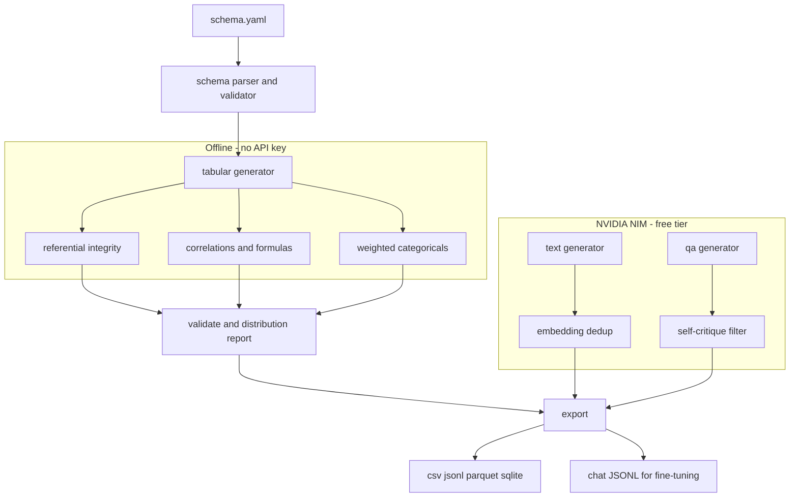

# synthetic-data-factory

**Generate realistic synthetic datasets from a schema** — tabular data with real referential integrity (zero API, fully offline), plus LLM-generated text, reviews, and Q&A pairs on free NVIDIA NIM — with validation and fine-tuning export.


Need 5,000 orders that reference real customers, with weighted countries and a `line_total` that actually equals `quantity * unit_price`? Need a class-balanced text-classification set or a batch of Q&A pairs to fine-tune on? This does both, from a single small YAML file, and the tabular half never touches the network.

---

## Why

Most "fake data" tools give you disconnected rows: a `customer_id` in `orders` that points at no real customer, categoricals that ignore the weights you asked for, and no way to prove the output matches the spec. And most *LLM* data generators skip the boring-but-critical parts: deduplication, class balance, and a quality filter.

This tool treats the two problems separately, because they are separate:

- **Structured data is a solved problem — do it in code.** Names, emails, dates, foreign keys, formulas, and correlations are generated deterministically with no LLM. It is instant, free, reproducible from a seed, and validated against the schema that produced it.
- **Unstructured data needs a model — do it well.** Text, reviews, and Q&A pairs go through a real pipeline: diversity-seeded prompts, embedding-based dedup, controlled class balance, and (for Q&A) a self-critique filter that drops weak items.

Everything is synthetic by construction and labeled as such. Nothing here is scraped, and nothing describes a real person.

---

## Architecture



The tabular path (left) is pure Python. The text and Q&A paths (right) call NIM. They share the same validation and export stages.

---

## Use cases

| Use case | What you generate | Path |
| --- | --- | --- |
| **Test & demo databases** | Related tables with valid foreign keys, ready to seed a dev DB | tabular |
| **Load testing** | Millions of deterministic rows, same every run for reproducible benchmarks | tabular |
| **Privacy-safe sharing** | A synthetic stand-in with the same shape as production, no real PII | tabular |
| **Fine-tuning corpora** | Class-balanced classification data or instruction pairs as chat JSONL | text / qa |
| **RAG evaluation sets** | Q&A pairs from your own docs, with hard negatives and a quality filter | qa |

---

## Quickstart

```bash
git clone https://github.com/AleBrito124356/synthetic-data-factory.git
cd synthetic-data-factory
pip install -r requirements.txt

# Tabular needs nothing else — generate right now:
python cli.py generate tabular --schema schemas/ecommerce.yaml --out results/ --format csv,sqlite --validate
```

For the text/qa generators, get a **free** NVIDIA NIM key (about two minutes at
[build.nvidia.com](https://build.nvidia.com) — open any model, click *Get API Key*, copy the `nvapi-...` value):

```bash
cp .env.example .env
# edit .env and paste your key:
#   NVIDIA_API_KEY=nvapi-your-real-key
```

---

## Usage

### 1. Tabular data (offline)

```bash
python cli.py generate tabular --schema schemas/ecommerce.yaml --out results/ \
    --format csv,jsonl,sqlite --validate
```

```
Generated tables:
  customers: 500 rows
  products: 80 rows
  orders: 2000 rows
  order_items: 5000 rows

Wrote 9 file(s) to results/
...
9/9 ... [PASS] foreign_key :: order_items.order_id
[PASS] distribution :: orders.status   max deviation 0.001
```

The `--validate` flag re-checks the output against the schema: types, uniqueness, foreign keys, and whether categorical proportions match the weights you requested.

### 2. Distribution report

```bash
python cli.py report --schema schemas/saas-users.yaml
```

```
## accounts  (300 rows)
- plan [category] nulls=0
    observed/expected: free=0.55/0.55, pro=0.30/0.30, enterprise=0.15/0.15
- mrr [float] nulls=0
    min=383 max=1.18e+04 mean=5.99e+03 std=3e+03   # correlated with seats
```

### 3. Text datasets (NIM)

```bash
python cli.py generate text --task schemas/text-task.yaml \
    --out results/reviews.jsonl --chat results/reviews.chat.jsonl
```

```
Wrote 24 text record(s) to results/reviews.jsonl
  sentiment distribution: negative=7, neutral=5, positive=12
Wrote chat-format SFT file to results/reviews.chat.jsonl
```

Swap `task:` in the YAML to `classification`, `personas`, `tickets`, or `paraphrase`.

### 4. Q&A / instruction pairs (NIM)

```bash
python cli.py generate qa --task schemas/qa-example.yaml \
    --out results/qa.jsonl --chat results/qa.chat.jsonl --with-context
```

```
Wrote 11 Q&A pair(s) to results/qa.jsonl
Average quality (min of 3 axes): 4.55
Wrote chat-format SFT file to results/qa.chat.jsonl
```

Each pair carries `question`, `answer`, `context`, a `hard_negative`, and per-axis quality scores. The `--chat` file is ready for the trainers in **fine-tuning-playbook**.

### As a library

```python
from factory import generate, validate_dataset, export_dataset

dataset = generate("schemas/ecommerce.yaml", seed=42)
report = validate_dataset(dataset)
assert report.ok

df = dataset.to_pandas()["orders"]          # -> pandas DataFrame
export_dataset(dataset, "results/", formats=["parquet", "sqlite"])
```

---

## Schema reference

A schema is one YAML file: a `seed` and a list of `tables`, each with `rows` and `fields`.

| Field `type` | Purpose | Key options |
| --- | --- | --- |
| `id` | Primary key | `strategy: sequential\|uuid`, `start`, `prefix` |
| `uuid` | Random UUID | — |
| `int` / `float` | Numbers | `min`, `max`, `round`, `distribution: uniform\|normal\|exponential`, `mean`, `std`, `scale` |
| `category` | Weighted categorical | `categories:` as a list or a `value: weight` map |
| `bool` | Boolean | `true_rate` |
| `name` / `first_name` / `last_name` | People | — |
| `email` | Email address | `depends_on:` a name field to derive it, `unique` |
| `phone`, `city`, `country`, `address`, `company`, `job`, `url`, `ipv4` | Realistic values | — |
| `date` / `datetime` | Timestamps | `start`, `end` |
| `text` | Lorem sentences | `sentences` |
| `foreign_key` | Reference to another table | `references: table.column`, `unique` for 1:1 |
| `formula` | Computed from sibling columns | `expr:` e.g. `round(quantity * unit_price, 2)` |

Cross-cutting options on any field: `unique: true`, `null_rate: 0.1`, and (on numerics) `correlate: {field: other, strength: 0.8, direction: positive}`.

```yaml
seed: 42
tables:
  - name: customers
    rows: 500
    fields:
      - { name: customer_id, type: id, start: 1 }
      - { name: full_name,   type: name }
      - { name: email,       type: email, depends_on: full_name, unique: true }
      - name: country
        type: category
        categories: { Panama: 0.3, Mexico: 0.2, United States: 0.5 }
  - name: orders
    rows: 2000
    fields:
      - { name: order_id,    type: id, prefix: "ORD-" }
      - { name: customer_id, type: foreign_key, references: customers.customer_id }
      - { name: quantity,    type: int, min: 1, max: 5 }
      - { name: unit_price,  type: float, min: 5, max: 400, round: 2 }
      - { name: line_total,  type: formula, expr: "round(quantity * unit_price, 2)" }
```

**Formulas are safe.** The `expr` is parsed to an AST and evaluated against a whitelist of arithmetic, comparisons, `if/else`, and a fixed set of math functions. There is no attribute access, no subscripting, and no `eval` — so a schema can never read a file or import a module.

Three complete tabular examples ship in `schemas/`: `ecommerce.yaml`, `saas-users.yaml`, and a synthetic `healthcare.yaml`.

---

## The zero-dollar split

The two halves are deliberately independent:

| | Tabular | Text / Q&A |
| --- | --- | --- |
| Needs an API key | No | Yes — free NIM |
| Network | None | NIM endpoint |
| Cost | $0 | $0 on the free tier |
| Deterministic | Yes, from `seed` | Best-effort, temperature-controlled |
| Import cost | `openai` never imported | Lazy — only when you call it |

You can build a fully-related test database on a plane with no wifi. Add the LLM layer only when you need natural language.

Determinism detail: each table is seeded from `seed + table_name`, so **adding a new table never shifts the values of existing ones** — a property the test suite locks down.

---

## Ethics and safe use

- **Everything generated here is synthetic.** Names, emails, IPs, and the healthcare example are fictional. Emails use `example.com`, IPs use the RFC 5737 documentation range, and phone numbers are non-routable. Never present any output as a real record, review, or person.
- **The `healthcare.yaml` example is not PHI.** It exists to demonstrate schema features. Do not mix it with, or pass it off as, real patient data.
- **Synthetic data is not automatically private.** If you model a schema on production and the domain is small, rare combinations can still be identifying. Treat privacy-safe sharing as a design decision, not a guarantee.
- **Generated reviews and tickets are for training and testing**, not for posting anywhere as genuine user feedback.

The validation report and every distribution report carry an explicit synthetic-data notice for exactly this reason.

---

## Project structure

```
synthetic-data-factory/
├── cli.py                    # generate tabular|text|qa, validate, report
├── src/factory/
│   ├── schema.py             # YAML -> validated dataclasses, clear errors
│   ├── tabular.py            # offline generator: FKs, correlations, formulas
│   ├── providers.py          # realistic value pools (names, cities, ...)
│   ├── formula.py            # safe AST-based expression evaluator
│   ├── text.py               # NIM: reviews, classification, personas, tickets
│   ├── qa.py                 # NIM: Q&A pairs, hard negatives, self-critique
│   ├── validate.py           # schema/uniqueness/FK/distribution checks + report
│   ├── export.py             # csv, jsonl, parquet, sqlite, chat JSONL for SFT
│   └── nim.py                # OpenAI-compatible NVIDIA NIM client
├── schemas/                  # 3 tabular + 1 text + 1 qa example
├── examples/seed_docs/       # sample docs for the qa generator
└── tests/                    # schema, referential integrity, distribution, seed, formula
```

Run the tests (no API key needed — the tabular path covers all of them):

```bash
pytest -q      # 32 passed
```

---

## Related projects

Part of a series of small, focused tools on free NVIDIA NIM:

- **[fine-tuning-playbook](https://github.com/AleBrito124356/fine-tuning-playbook)** — Feed the chat-format JSONL from here straight into QLoRA/DPO training and GGUF export.
- **[llm-eval-toolkit](https://github.com/AleBrito124356/llm-eval-toolkit)** — Prompt regression testing and evaluation; pair it with synthetic eval sets from this repo.
- **[rag-blueprints](https://github.com/AleBrito124356/rag-blueprints)** — Eight RAG architectures; the Q&A generator produces the question/answer sets to evaluate them.
- **[data-cleaning-toolkit](https://github.com/AleBrito124356/data-cleaning-toolkit)** — The inverse job: profile, standardize, and validate messy *real* CSVs.

---

## License

MIT © 2026 Alejandro Brito. See [LICENSE](LICENSE).
